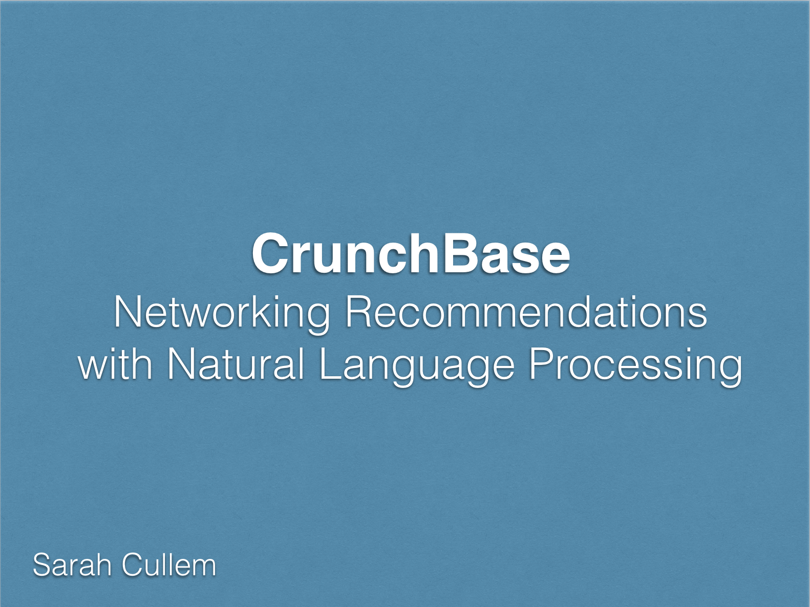

# Project Objective:

This project was completed as a three week assignment for the Metis Data Science Bootcamp. My approach was to build a recommendation engine using company descriptions and investment history from CrunchBase (www.crunchbase.com) in order to recommend company and investor profiles to follow. For this project, I imagined that I work on the product team for CrunchBase and want to create an experimental product feature called 'Networker' that makes it easy to identify other companies/investors a user might find useful. A user would enter the name of a company that represents what they are interested in, and the tool will return the profiles of companies and investors to check out and follow.

# Process
* Import 2013 snapshot of CrunchBase's database (provided by CrunchBase) into SQL database
* Select US companies and investors to include in the model
* Apply Natural Language Processing (NLP) tools to process the text data for each company's description: word tokenization, TFIDF
* Condense terms using Non-negative matrix factorization (NMF) for topic modeling
* Assign TFIDF term scores and NMF topic scores to each business and investor (average scores across all companies invested in)
* Use cosine distance as a metric to measure similarity between businesses as well as businesses and investors
* Return "top n" businesses and investors based on similarity to any selected business in the CrunchBase dataset

The code for processing the text data and building topics can be found in the file: [Feature_Extraction_TFIDF_NMFTopics.ipynb](https://github.com/scullem/crunchbase_recommender/blob/master/Feature_Extraction_TFIDF_NMFTopics.ipynb)  
The code for calculating similarity and returning recommendations can be found in the file: [Recommendations_Similarity_Businesses_Investors.ipynb](https://github.com/scullem/crunchbase_recommender/blob/master/Recommendations_Similarity_Businesses_Investors.ipynb) 

See the presentation below for a summary of findings:

<iframe src="//www.slideshare.net/slideshow/embed_code/key/tfjX28LAAliFQ7" width="595" height="485" frameborder="0" marginwidth="0" marginheight="0" scrolling="no" style="border:1px solid #CCC; border-width:1px; margin-bottom:5px; max-width: 100%;" allowfullscreen> </iframe> 
 <strong> <a href="//www.slideshare.net/scullem/building-recommendations-with-natural-language-processing" title="Building Recommendations with Natural Language Processing" target="_blank">Building Recommendations with Natural Language Processing</a> </strong> from <strong><a target="_blank" href="//www.slideshare.net/scullem">Sarah Cullem</a></strong> 

